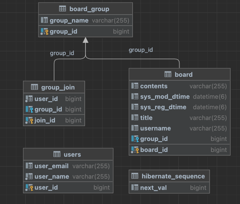

# TDD 방식으로 구현한 게시판 프로젝트
#### 일반적인 게시판 개념을 확장하여 그룹 게시판을 구현한다. 사용자는 그룹A, 그룹B와 같이 여러 게시판 그룹을 생성하고 소속될 수 있으며 소속되어 있는 그룹의 게시판에 읽기, 쓰기할 수 있다. 

## [개발환경]
- JAVA ver.11.0.13
- DB : mysql 8.0.32
- Spring boot : ver.2.7.10

## [참고자료]
### 도서
#### - 테스트 주도 개발 (켄트 벡 저서)

## [ERD]
